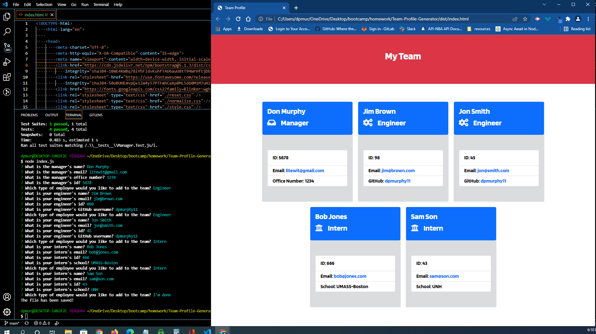

# Team-Profile-Generator
  ## Description
A Node.js command-line application that takes in information about employees on a software engineering team, then generates an HTML webpage that displays summaries for each person.
  ## Table of Contents
* [Installation](#installation)
* [Usage](#usage)
* [Tests](#tests)
* [Features](#features)
* [Technology](#technology)
* [License](#license)
* [Screenshot](#screenshot)
* [Repository](#repository-httpsgithubcomdpmurphy11team-profile-generator)
* [Demo Video](#demo-video-httpsdrivegooglecomfiled1vdxtt3qlwauhv6dmubyj1rm5q6tkl8enview)
* [Generated HTML File](#generated-htmlhttpsgithubcomdpmurphy11team-profile-generatortreemaindistindexhtml)
* [Questions](#questions)
## Installation
  To install the project dependencies, run the following command:
  ```
  npm i
  ```
## Usage
  To run the program, enter the following command:
  ```
  node index.js
  ```
## Tests
  To run tests, run the following command:
  ```
  npm test
  ```
## Features
```md
When a user prompted for my team members and their information, an HTML file is generated that displays a nicely formatted team roster based on user input
When a user clicks on an email address in the HTML, the users default email program opens and populates the TO field of the email with the address
When a user clicks on the GitHub username, that GitHub profile opens in a new tab
When a user starts the application, they are prompted to enter the team manager’s name, employee ID, email address, and office number
When a user enters the team manager’s name, employee ID, email address, and office number, they are presented with a menu with the option to add an engineer or an intern or to finish building their team
When a user select the engineer option, they are prompted to enter the engineer’s name, ID, email, and GitHub username, and taken back to the menu
When a user selects the intern option, they are prompted to enter the intern’s name, ID, email, and school, and taken back to the menu
When a user decide to finish building their team, they exit the application, and the HTML is generated
Four test suites were written using Jest i order to run test on Employee, Manager, Intern, and Engineer classes.
```
## Technology
```md
* VSCode terminal
* Node.js
* HTML
* CSS
* JavaScipt
* Template literals
* JavaScript modules
* Async writeFile
* Object Oriented Programming
* Jest
* Inquirer
* Unit Testing
* Bootstrap
* FontAwsome
```
### License
[](https://github.com/dpmurphy11/Team-Profile-Generator/blob/main/LICENSE)
### Screenshot

### Repository: <https://github.com/dpmurphy11/Team-Profile-Generator>
### Demo Video: <https://drive.google.com/file/d/1vDXTt3QlWAuHV6dMUbYj1Rm5q6TKl8en/view>
### [Generated HTML](https://dpmurphy11.github.io/Team-Profile-Generator/dist/index.html)
### Questions
  If you have any questions about the repo, open an issue or contact me at dpmurphy_onsite@hotmail.com
  Visit my GitHub profile at [dpmurphy11](https://github.com/dpmurphy11/).